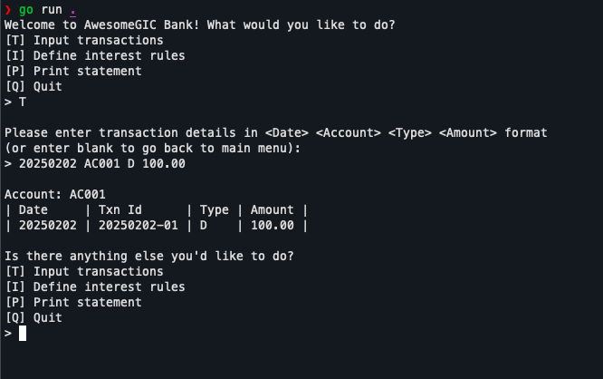

# Bank Account Interest



A command line application written in Go.

Allows users to:

1. make transactions on an account (deposits, withdrawals)
2. define interest rates
3. list the transactions for an account on given month, including balances and interest earned

See [REQUIREMENTS.md](REQUIREMENTS.md) for full details.

## Usage

Must have Go > 1.24

```
go run .
```